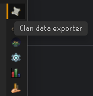
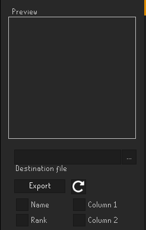
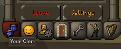
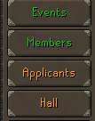
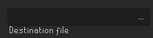
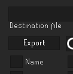

# Clan Data Exporter

---
A plugin for exporting clan data in .csv form
## User guide

---
### 1. Open the exporter from your navigation bar

---
### 2. Select what data you want to export

Select data to be exported via the checkboxes above.

---
### 3. Navigate to the clan members page
First, go to "Your Clan", and select "Settings"

Then, select "Members"

---
### 4. Select the file destination

---
### 5. Export
